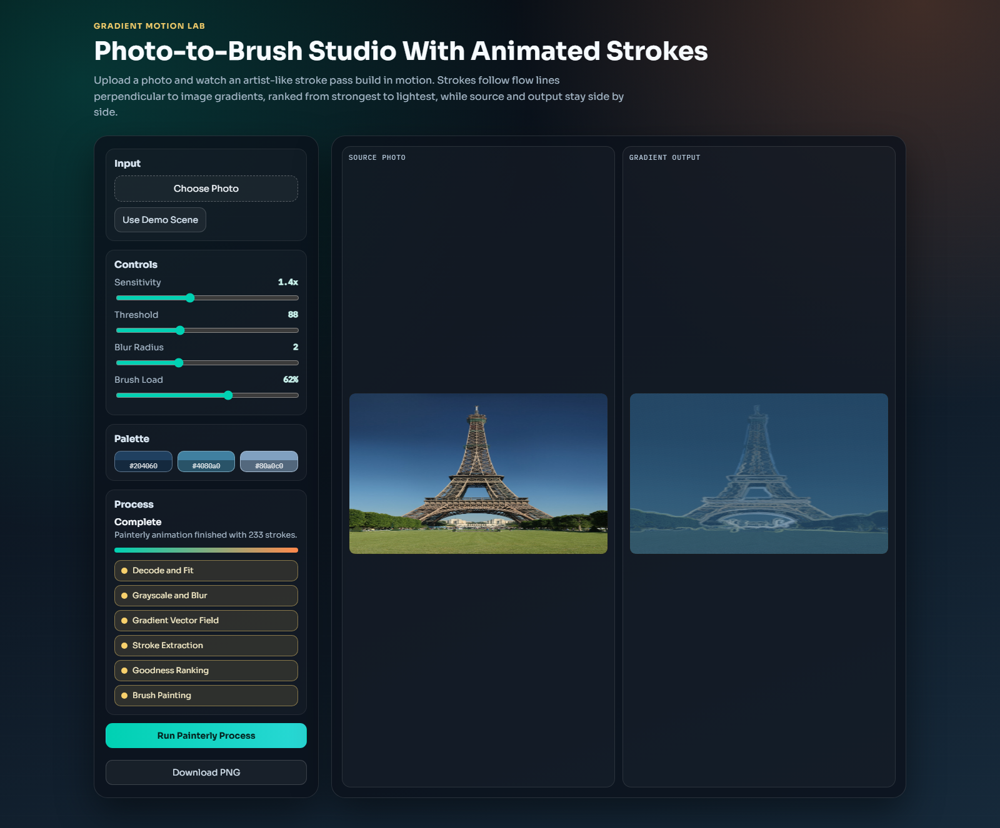
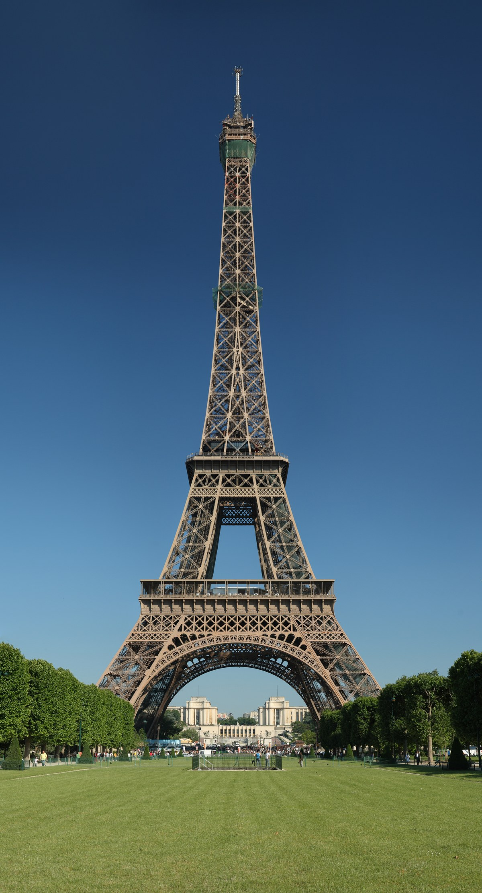
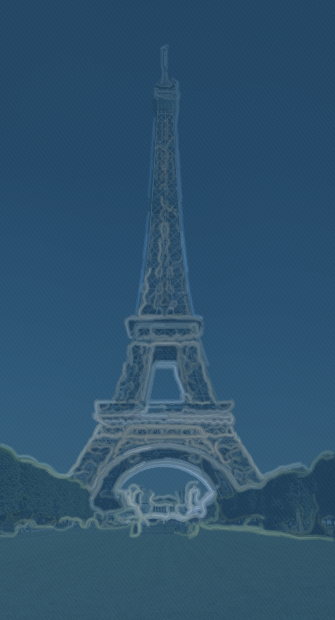

# Gradient Motion Lab

## Eiffel Tower Demo (First Look)



| Eiffel Input | Painterly Output |
| --- | --- |
|  |  |

Input photo source: [Wikimedia Commons - Tour Eiffel Wikimedia Commons](https://commons.wikimedia.org/wiki/File:Tour_Eiffel_Wikimedia_Commons.jpg)

Gradient Motion Lab is a modern browser tool that turns a photo into animated painterly strokes.

## Features

- Side-by-side layout: source photo on the left, processed result on the right
- Animated painterly pipeline (not instant output):
  - Decode and fit
  - Grayscale and blur
  - First-order gradient vector field
  - Stroke extraction along directions perpendicular to gradients
  - Goodness ranking by stroke length and intensity
  - Brush painting from strong strokes to light strokes
- Spatially coherent ordering so nearby strokes are painted consecutively
- Live controls for sensitivity, threshold, blur radius, and brush load
- Palette extraction from the input image
- PNG export for the generated result
- Responsive desktop/mobile layout

## Run Locally

This project is fully static and has no build step.

1. Clone the repository.
2. Open `index.html` in your browser.

For best behavior with local file uploads, you can also serve it:

```bash
python -m http.server 8080
```

Then open `http://localhost:8080`.

## Deploy

Deploy directly with GitHub Pages:

1. Push to `main`.
2. In repository settings, enable Pages from branch `main` and root (`/`).
3. Your app will be live at:

`https://le-nicolas.github.io/Gradient/`

## Tech

- HTML5
- CSS3
- Vanilla JavaScript
- Canvas API
