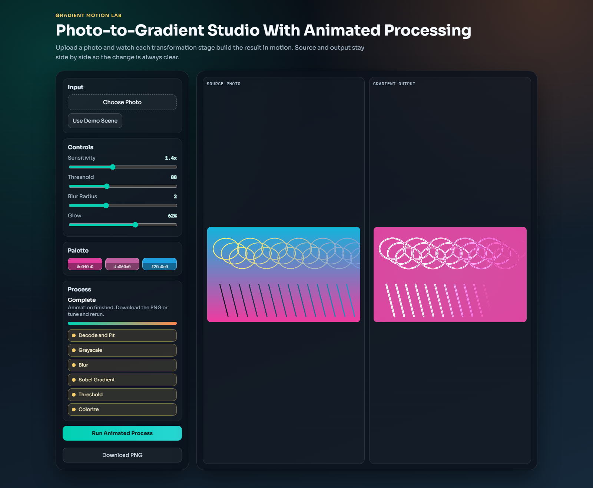
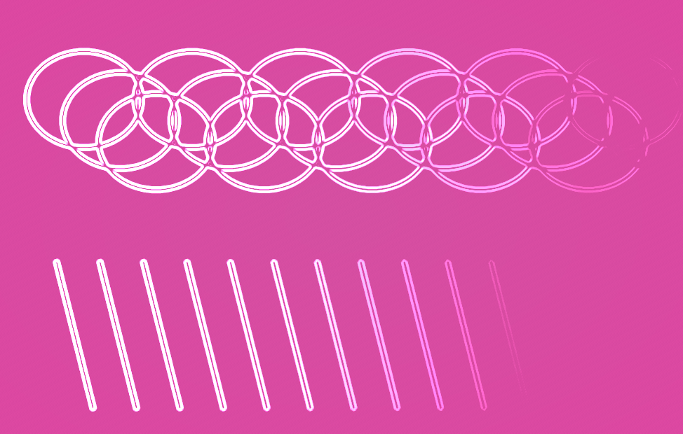

# Gradient Motion Lab

Gradient Motion Lab is a modern browser tool that turns a photo into an animated gradient map.

It is designed for:

- designers who want fast edge-aware visual references
- creators who want a quick "photo -> stylized gradient" workflow
- learners who want to see image-gradient processing happen step by step

## Features

- Side-by-side layout: source photo on the left, processed result on the right
- Animated pipeline (not instant output):
  - Decode and fit
  - Grayscale
  - Blur
  - Sobel gradient
  - Threshold
  - Colorized output
- Live controls for sensitivity, threshold, blur radius, and glow
- Palette extraction from the input image
- PNG export for the generated result
- Responsive desktop/mobile layout

## Visual Preview

### Full App UI



### Sample Input vs Output

| Sample Input | Processed Output |
| --- | --- |
|  |  |

## Run Locally

This project is fully static and has no build step.

1. Clone the repository.
2. Open `index.html` in your browser.

For best behavior with local file uploads, you can also serve it:

```bash
python -m http.server 8080
```

Then open `http://localhost:8080`.

## Deploy

Deploy directly with GitHub Pages:

1. Push to `main`.
2. In repository settings, enable Pages from branch `main` and root (`/`).
3. Your app will be live at:

`https://le-nicolas.github.io/Gradient/`

## Tech

- HTML5
- CSS3
- Vanilla JavaScript
- Canvas API
